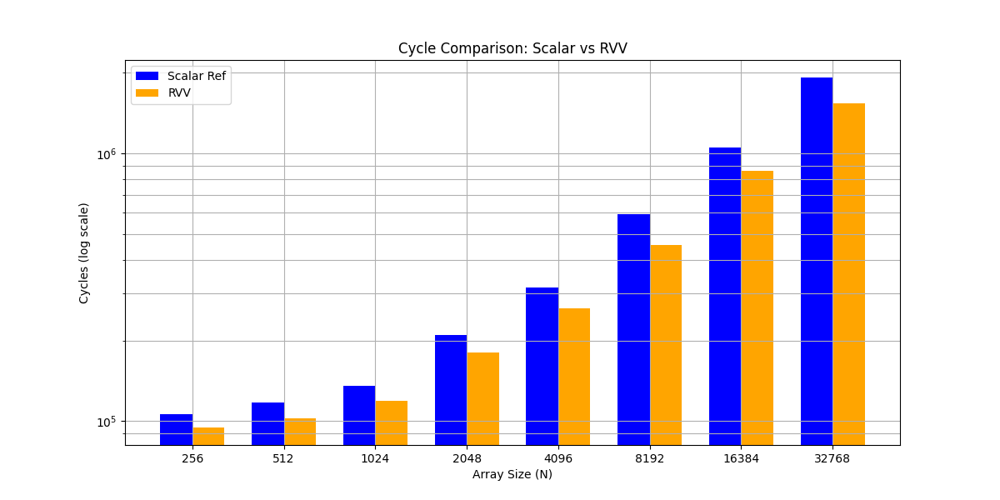
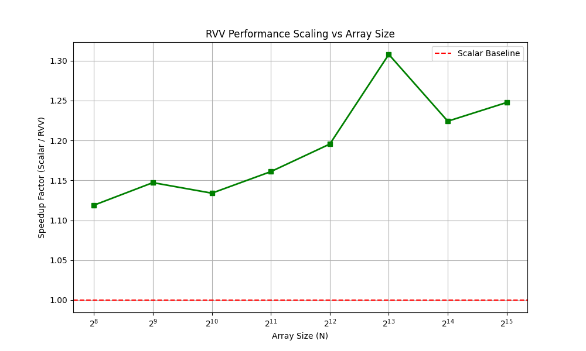

# Q15_AXPY - RISC-V Vector Extension Implementation


## Overview

This implements a vectorized Q15 (16-bit fixed-point) AXPY operation using the RISC-V Vector Extension v1.0. The implementation demonstrates:

- **Saturating arithmetic** to maintain Q15 range constraints (`[-32768, 32767]`)
- **Widening operations** to prevent intermediate overflow
- **Fused multiply-accumulate** for optimal throughput
- **LMUL=4 grouping** for maximum vector register utilization

### Operation

```
y[i] = saturate_q15(a[i] + α · b[i])
```

Where:
- `a`, `b`, `y` are arrays of 16-bit signed integers (Q15 format)
- `α` is a scalar multiplier
- Result is saturated to Q15 range

## Project Structure

```
Q15_AXPY/
├── solution.c          # Main implementation (scalar + RVV)
├── compile.bash        # Build script
├── run.bash           # Execution script
├── script.py          # Performance analysis/plotting
├── results/           # Performance data and graphs
├── .vscode/           # VSCode configuration
└── README.md
```

## Building

### Prerequisites

- RISC-V GCC toolchain with RVV support (`riscv64-unknown-elf-gcc` or `riscv64-linux-gnu-gcc`)
- QEMU user-mode for RISC-V (for emulation)
- Python 3 with matplotlib/numpy (for analysis scripts)

### Compile

```bash
./compile.bash
```

Or manually:
```bash
riscv64-unknown-elf-gcc -march=rv64gcv -O3 -o q15_axpy solution.c
```

**Compiler flags:**
- `-march=rv64gcv`: Enable RVV extension
- `-O3`: Maximum optimization
- `-static`: Static linking (for QEMU)

## Running

### On QEMU (Emulation)

```bash
./run.bash
```

Or manually:
```bash
qemu-riscv64 ./q15_axpy 4096
```

### On Real Hardware

```bash
./q15_axpy 4096
```

**Note:** Performance measurements on QEMU **do not reflect real hardware**. QEMU interprets instructions sequentially and cannot model parallel vector execution.

## Performance Analysis


### QEMU Results (Functional Verification Only)

```
Cycles ref: 300000 ( on avg for N = 4096)
Cycles RVV: 250000
Speedup: ~(1.2 -1.5)x

<p align="center">
  
</p>

<!-- 
 -->
```

### Analysis Scripts

```bash
python3 script.py
```

Generates performance plots and analysis in `results/` directory.

## Implementation Details

### Scalar Reference

Standard C implementation with manual saturation:

```c
void q15_axpy_ref(const int16_t *a, const int16_t *b,
                  int16_t *y, int n, int16_t alpha)
{
    for (int i = 0; i < n; ++i) {
        int32_t acc = (int32_t)a[i] + (int32_t)alpha * (int32_t)b[i];
        y[i] = sat_q15_scalar(acc);
    }
}
```

### RVV Vectorized

Key RVV intrinsics used:

| Intrinsic | Purpose |
|-----------|---------|
| `vsetvl_e16m4` | Set vector length for 16-bit, LMUL=4 |
| `vle16_v_i16m4` | Vector load 16-bit signed |
| `vwcvt_x_x_v_i32m8` | Widen 16-bit → 32-bit (prevent overflow) |
| `vwmacc_vx_i32m8` | Fused widening multiply-accumulate |
| `vnclip_wx_i16m4` | Narrow 32-bit → 16-bit with saturation |
| `vse16_v_i16m4` | Vector store 16-bit signed |

**Vector Length Calculation:**
```
VL = (VLEN × LMUL) / SEW = (128 × 4) / 16 = 32 elements/iteration
```

### Why LMUL=4?

- **Maximum throughput:** Process 32 elements per iteration
- **Register pressure:** Uses 8 vector registers (m8 for 32-bit intermediate)
- **Trade-off:** Higher LMUL → more elements but fewer available registers

## Verification

The implementation includes built-in correctness verification:

```
Verify RVV: OK (max diff = 0)
```

Compares RVV output against scalar reference for all test cases.

